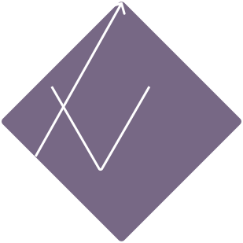

<div style="display: flex; align-items: center;">
  
  <h1>IU components library</h1>
</div>

## Table of Contents

- [Introduction](#introduction)
- [Technologies](#technologies)
- [Prerequisites](#prerequisites)
- [Setup](#setup)
- [Structure](#structure)
- [Users](#users)

## Introduction

IU - library of html/css components

## Technologies

| Function         | Used                                                                                                                                                                                                  |
|------------------|-------------------------------------------------------------------------------------------------------------------------------------------------------------------------------------------------------|
| Backend          |       |
| Database         |                                                                                                                                  |
| Message broker   |                                                                                                                                    |
| Frontend         |    |
| Site structure   |                                                                          |
| Version control  |                                                                                                                                         |
| Containerization |                                                                                                                                      |

- Backend: Java with Spring Boot provides good foundation with security features, and database integration. Maven makes config readable and easy to work with.

- Frontend: React paired with Bun offers a fast dev experience. React make use of reusable components and has compatibility with a lot of libraries, while Bun significantly improves build times and OOTB hot updating.

- Database: PostgreSQL was selected for its reliability and integration in hibernate.

- Message Broker: RabbitMQ enables async communication, and works great with spring.

- Containerization: Docker ensures consistent development and deployment environments, making the application easily portable and scalable across different platforms.

## Prerequisites

* Git
* Docker
* Docker compose

## Setup

### Clone the repository:

```sh
  git clone https://github.com/patrykmil/ztpai.git
```

### Configure environment variables:

* Rename .env.template to .env 
* Fill with your own values

### Start the application using Docker Compose:

```sh
  docker compose up -d --build
```

## Structure

| Service    | Ports           | Description                           |
|------------|-----------------|---------------------------------------|
| API        | 8080            | Spring Boot application               |
|            | 5005            | Remote debugging port                 |
| Website    | 5173            | React dev server with hot reloading   |
| Database   | 5432            | PostgreSQL                            |
| RabbitMQ   | 5672            | AMQP protocol                         |
|            | 5671            | AMQP with TLS                         |
|            | 15672           | Management panel                      |


### Architecture


### Entity Relationship Diagram


## Users

Predefined users:

- Admin 1:
  - email: iuadmin@iu.iu
  - password: adminadmin
- User 2:
  - email: patryk@gmail.com
  - password: iU4qQKZugAR6Tb
- User 3:
  - email: none@proton.me
  - password: py4369t!nM4
